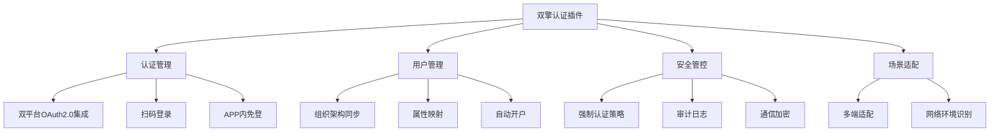

# NextCloud双擎认证插件产品说明文档：全方位企业集成解决方案

## 1. 产品概述

NextCloud双擎认证插件是一款专业级企业集成解决方案，通过无缝对接企业微信和钉钉两大国内主流办公平台，为企业提供安全、统一的身份认证入口。本插件基于OAuth 2.0协议开发，支持多种认证场景，让企业员工能够使用现有的企业微信或钉钉账号直接登录NextCloud，实现一站式办公体验。

## 2. 核心功能架构

以下是插件核心功能的结构化展示，涵盖了企业集成认证的关键方面：

## 3. 全场景适配功能详解

### 3.1 多终端访问场景

- **PC端办公场景**：员工在办公室通过PC浏览器访问NextCloud时，可直接使用企业微信或钉钉扫码登录，无需记忆额外账号密码。插件提供两种门户展示方式：一种是默认登录方式为本地密码认证，需点击图标跳转；另一种是直接展示为默认认证方式，提升登录效率。

- **移动端无缝体验**：员工在外出或移动办公时，通过手机访问NextCloud场景下，插件支持智能终端识别。在钉钉或企业微信APP内访问时，可自动唤起相应APP完成认证，实现一键登录。对于部分不能自动呼起APP的机型，插件会提供手动跳转指引。

### 3.2 组织架构与用户管理

- **自动化用户同步**：插件可定期从企业微信或钉钉平台同步完整的组织架构和用户信息至NextCloud本地目录，保持两边数据一致性。管理员可设置同步频率和策略，支持全量同步和增量同步两种模式。

- **智能用户匹配**：当新用户首次通过企业微信/钉钉认证时，插件可自动在NextCloud中创建对应账号；对于已存在用户，插件支持通过账号、人员姓名等字段模糊匹配，实现平滑迁移。

- **动态权限管理**：基于同步的组织架构，管理员可在NextCloud中按部门/用户组设置不同的访问权限，实现精细化的文件访问控制。

### 3.3 安全与管控特性

- **认证策略强制**：管理员可设置强制使用企业微信/钉钉认证，并选择性禁用NextCloud本地密码登录，强化统一入口管理。

- **全面审计日志**：插件记录完整的用户登录日志，包括登录时间、认证方式、IP地址等关键信息，满足企业安全审计需求。

- **通信安全保障**：所有认证通信均通过HT加密通道传输，保证认证数据不被窃取或篡改。

## 4. 企业特殊场景支持

### 4.1 混合网络环境支持

- **内外网穿透场景**：针对企业有内网应用的情况，插件支持类似“钉钉APP拉起MiniConnect APP单点登录”的隧道应用访问模式，员工可通过钉钉或企业微信直接访问内网NextCloud资源。

- **域名/IP适配**：插件支持域名和IP两种接入方式。正式环境建议使用域名接入以保证稳定性；测试或特殊环境下也可使用IP地址直接访问。

### 4.2 集成扩展能力

- **多平台兼容**：除核心的企业微信和钉钉认证外，插件架构设计支持扩展其他认证方式，如未来可扩展飞书、OA账号等认证方式。

- **API接口开放**：插件提供标准API接口，支持与企业现有IM系统、单点登录平台等第三方系统对接，满足企业定制化集成需求。

## 5. 技术配置要求

### 5.1 环境准备

- **服务器要求**：NextCloud 服务器需要与企业微信/钉钉服务器保持网络连通性，确保认证过程顺畅。
- **域名准备**：正式环境建议准备域名并配置SSL证书，避免因使用IP地址而被平台限制。
- **平台应用创建**：需要在企业微信和钉钉开放平台分别创建应用，获取对应的AppKey、AppSecret、AgentId等参数。

### 5.2 配置流程

1. **平台端配置**：在企业微信/钉钉开发者后台创建应用，配置授权回调域名，设置接口权限等。
2. **插件端配置**：在NextCloud管理后台安装插件后，填入从平台获取的对应参数，测试认证连通性。
3. **策略配置**：根据企业需求，设置认证策略、用户同步规则和权限映射关系。

## 6. 企业价值体现

- **提升管理效率**：通过自动化用户生命周期管理，减少IT管理员手动创建账号、分配权限的工作量，提高工作效率。
- **增强安全性**：统一认证入口结合企业级安全策略，降低密码泄露风险，满足企业合规性要求。
- **优化员工体验**：员工无需记忆多套账号密码，使用熟悉的办公平台即可无缝登录，提升工作效率和满意度。
- **降低成本**：减少因账号管理带来的IT支持负担，同时避免多系统账号管理带来的安全隐患和处理成本。

本产品说明文档涵盖了NextCloud双擎认证插件在企业环境中的全部应用场景和功能特性，企业可根据自身需求灵活配置使用。通过这款插件，企业能够构建统一、安全、高效的数字化办公平台，助力企业数字化转型。